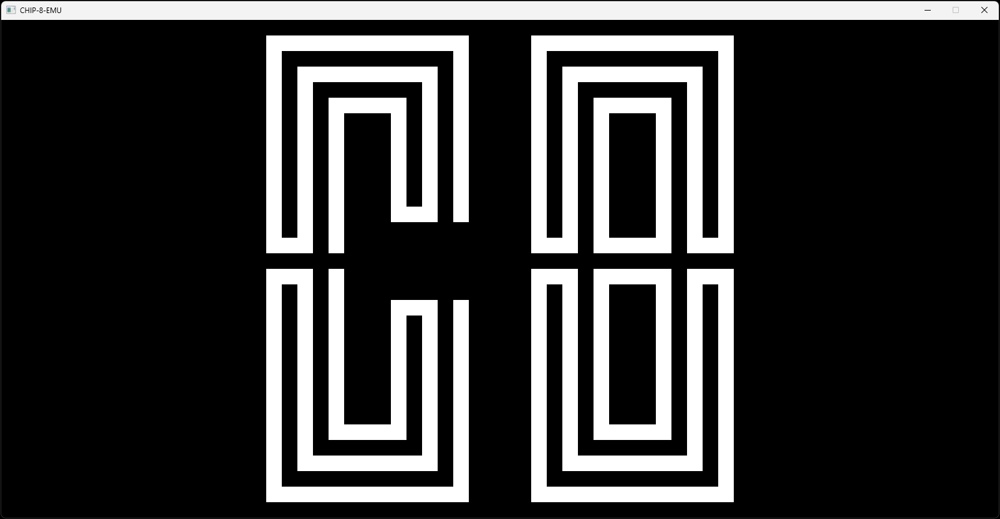

# (Another!) CHIP-8 Interpreter, in Rust

## Summary

(Image of <a href="https://github.com/loktar00/chip8/tree/master/roms">&rsquo;Chip8 emulator Logo [Garstyciuks]&lsquo;</a> ROM running on this interpreter).

This repository contains my attempt at a [CHIP-8](https://en.wikipedia.org/wiki/CHIP-8)
emulator written in Rust. I decided to do this as a quick, fun project for my own
interest and education.

The [sdl2](https://crates.io/crates/sdl2) crate is used to handle graphics,
keyboard events, and audio; the core interpreter has been written from scratch.

## Installation

- [sdl2](https://crates.io/crates/sdl2) must be installed manually, the instructions
  for which can be found at the linked page. This project does not use the `bundled`
  feature, and so `SDL2.dll` should be added to this repository for it to work correctly.
- Once this has been set up, the interpreter can be ran with `cargo run --release <path/to/rom>`.

ROMs are not provided with this repository and must be downloaded separately,
but many can easily be found online.

The speed of the interpreter can be adjusted by changing the `CPU_TICK_RATE` found 
in [`main.rs`](./src/main.rs).

## Credits

- [Cowgod's Chip-8 Technical Reference](http://devernay.free.fr/hacks/chip8/C8TECH10.HTM)
  provides a very helpful overview of the CHIP-8 system and instruction set.
- [Timendus' CHIP-8 test suite](https://github.com/Timendus/chip8-test-suite) has
  proven very useful for testing the various parts of the interpreter's functionality.
- The aforementioned [sdl2](https://crates.io/crates/sdl2) crate and its associated documentation made it very easy to focus on implementing the interpreter itself.